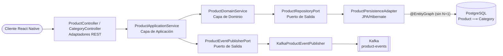

[](https://github.com/apchavez/spring-jpa-native/actions/workflows/ci.yml)
[](https://sonarcloud.io/summary/new_code?id=apchavez_spring-jpa-native)
[](https://sonarcloud.io/summary/new_code?id=apchavez_spring-jpa-native)
[](https://sonarcloud.io/summary/new_code?id=apchavez_spring-jpa-native)

# Spring JPA Native

Product Service API en **Spring Boot MVC + JPA/Hibernate** con **Arquitectura Hexagonal**, y un frontend **móvil** en **React Native + Expo** (en vez de un frontend web como el resto de la familia). A diferencia de sus hermanos, este repo introduce una relación real `@ManyToOne`/`@OneToMany` entre `Product` y `Category`, y usa el estilo de persistencia nativo de JPA (entidades gestionadas, `@EntityGraph` para evitar N+1, `@Version` para bloqueo optimista, auditing automático) en vez de Spring Data JDBC/R2DBC.

Comparte el dominio de **Product Management** con **spring-webflux-angular**, **spring-mvc-angular**, **quarkus-react** y **net-vue**, pero con un modelo de datos más rico (categorías como entidad propia, no un campo string) y un cliente móvil real en vez de una SPA web.

---

## Estructura

```
├── api/        Backend Spring Boot MVC + JPA/Hibernate (Java 21, Arquitectura Hexagonal)
├── mobile/     Frontend React Native + Expo (TypeScript, Expo Router) — ver mobile/README.md
├── chart/      Helm chart del backend
├── postman/    Colección de Postman + entornos (local, docker)
├── infra/      Config de scraping de Prometheus, provisioning de datasource de Grafana
└── docker-compose.yml
```

---

## Stack Tecnológico

### Backend (`api/`)

| Categoría | Tecnología |
|---|---|
| Lenguaje / Runtime | Java 21, Spring Boot 4.1.0 |
| Web | Spring MVC (bloqueante, Tomcat) |
| Persistencia | **Spring Data JPA / Hibernate** — entidades gestionadas, `@EntityGraph` (evita N+1 al resolver `Category` sobre `Product`), `@Version` (bloqueo optimista), auditing (`@CreatedDate`/`@LastModifiedDate`) |
| Base de datos | PostgreSQL 16 |
| Migraciones | Flyway (`db/migration/`, datos semilla de dev en `db/testdata/`) |
| Caché | Redis (rate limiting) |
| Mensajería | Apache Kafka (KRaft), eventos de producto (`PRODUCT_CREATED`/`PRODUCT_UPDATED`/`PRODUCT_DELETED`) |
| Seguridad | Spring Security + JWT RS256 (oauth2-resource-server), rate limiting |
| Observabilidad | Spring Boot Actuator, Micrometer + Prometheus, OpenTelemetry (OTLP) |
| API secundaria | **GraphQL** (Spring for GraphQL) sobre `/graphql`, GraphiQL en dev — misma autenticación y los mismos application services que REST, ver sección "GraphQL" más abajo |
| Documentación de API | Springdoc OpenAPI 2 (Swagger UI) |
| Import masivo | Parser CSV propio (sin librería adicional), fila por fila, con reporte de error por fila — reutiliza las mismas reglas de dominio que la creación individual |
| Reportes | `GET /api/v1/reports/inventory-summary` — agregación JPQL (totales + desglose por categoría), sin N+1 |
| Build | Gradle 9, JaCoCo (≥ 80% en `domain` y `application`) |
| Calidad de código | SonarCloud |
| Pruebas | JUnit 5, Testcontainers (PostgreSQL real), MockMvc |

### Frontend móvil (`mobile/`)

| Categoría | Tecnología |
|---|---|
| Framework | React Native + Expo (SDK actual), Expo Router, TypeScript |
| Navegación | Expo Router (stack + tabs, pestañas admin ocultas para rol `USER`) |
| Estado de auth | Context API + `expo-secure-store` (nativo) / `AsyncStorage` (fallback web) |
| Selector de categoría | Poblado desde `GET /api/v1/categories`, envía `categoryId` |
| Import CSV | `expo-document-picker` + `FormData` multipart |
| Ejecuta como | App real (Expo Go / simulador) **y** preview web (`expo start --web`) |

---

## Arquitectura (Backend)



```
api/src/main/java/com/apchavez/products
├── domain
│   ├── model          Product, Category, CategoryStockSummary
│   ├── exception      Excepciones de dominio tipadas (SKU duplicado, categoría inválida, stale/optimistic lock, ...)
│   ├── event           ProductEvent, ProductEventType
│   ├── port            ProductRepositoryPort, CategoryRepositoryPort, ProductEventPublisherPort
│   └── service          ProductDomainService (reglas de negocio puras)
├── application
│   ├── ProductApplicationService     (orquestación, import CSV fila por fila, @Transactional)
│   ├── CategoryApplicationService
│   └── ReportApplicationService      (composición del resumen de inventario)
└── infrastructure
    ├── auth            DemoUserStore (usuarios demo in-memory)
    ├── config           Security (JWT RS256), RateLimiting, RequestLogging, OpenApi, Kafka, JpaAuditing
    ├── csv               ProductCsvParser (parser propio, sin dependencia externa)
    ├── mapper            ProductMapper, ReportMapper
    ├── messaging         KafkaProductEventPublisher, NoOpProductEventPublisher
    ├── persistence       ProductEntity (@ManyToOne Category, @Version), CategoryEntity, repositorios JPA + adaptadores
    └── web               ProductController, CategoryController, AuthController, ReportController, DTOs, GlobalExceptionHandler
```

**Regla de dependencias:** `infrastructure` → `application` → `domain`. El dominio no conoce las capas externas.

**La relación JPA real** es la pieza central de este repo: `ProductEntity` tiene un `@ManyToOne(fetch = LAZY) Category`, y las consultas de listado usan `@EntityGraph` para resolver `categoryName` en una sola consulta SQL (verificado por `ProductNPlusOneQueryTest`, que cuenta las queries ejecutadas). Las actualizaciones concurrentes se protegen con `@Version` (bloqueo optimista, verificado por `ProductOptimisticLockingTest`), y la auditoría (`createdAt`/`updatedAt`) se genera automáticamente vía `JpaAuditingConfig` (verificado por `ProductAuditingTest`).

---

## Cómo Empezar

### Levantar todo con Docker Compose

```bash
docker compose up --build
```

- **API:** `http://localhost:8080` / Swagger UI: `http://localhost:8080/swagger-ui.html`
- **Prometheus:** `http://localhost:9090`
- **Grafana:** `http://localhost:3000` (datasource de Prometheus pre-provisionado)

### Solo backend

```bash
cd api
./gradlew bootRun --args='--spring.profiles.active=dev'
```

Requiere PostgreSQL y Redis corriendo localmente (o vía `docker compose up postgres redis`).

### Solo el frontend móvil

```bash
cd mobile
npm install
npx expo start          # Expo Go / simulador
npx expo start --web    # Preview en el navegador
```

Configurar `EXPO_PUBLIC_API_URL` (ver `mobile/.env.example`) apuntando al backend — en un dispositivo físico con Expo Go debe ser la IP de LAN del backend, no `localhost`.

---

## Colección de Postman

Importar `postman/spring-jpa-native.postman_collection.json` en Postman.

Incluye dos entornos:
- `postman/environments/local.postman_environment.json` — `http://localhost:8080`
- `postman/environments/docker.postman_environment.json` — stack levantado con `docker compose up`

La colección cubre login (admin/user con captura automática de `{{token}}`), CRUD completo de categorías y productos, búsqueda por prefijo y por rango de categoría/precio, import CSV, el reporte de inventario, y una carpeta **GraphQL** (query anidado producto+categoría, mutations de categoría/producto) usando el modo GraphQL nativo de Postman.

---

## Endpoints de la API

Ruta base: `/api/v1/products` y `/api/v1/categories` (autenticación: `/api/v1/auth`)

| Método | Ruta | Descripción | Respuestas |
|---|---|---|---|
| `POST` | `/api/v1/auth/login` | Login — retorna un JWT (público) | `200`, `400`, `401` |
| `GET` | `/api/v1/categories` | Listar categorías | `200` |
| `POST` | `/api/v1/categories` | Crear categoría (ADMIN) | `201`, `400` |
| `POST` | `/api/v1/products` | Crear producto | `201`, `400`, `404`, `409` |
| `GET` | `/api/v1/products/active?page=0&size=20` | Listar productos activos (sin N+1 vía `@EntityGraph`) | `200` |
| `GET` | `/api/v1/products/inactive?page=0&size=20` | Listar productos inactivos (vista admin) | `200` |
| `GET` | `/api/v1/products/search?prefix=&page=0&size=20` | Buscar por prefijo de nombre | `200` |
| `GET` | `/api/v1/products/search/by-category-price?categoryId=&minPrice=&maxPrice=` | Búsqueda JPQL con `JOIN FETCH` sobre categoría | `200` |
| `GET` | `/api/v1/products/sku/{sku}` | Buscar por SKU | `200`, `404` |
| `GET` | `/api/v1/products/{id}` | Buscar por ID | `200`, `404` |
| `PUT` | `/api/v1/products/{id}` | Actualización completa (bloqueo optimista vía `@Version`) | `200`, `400`, `404`, `409` |
| `POST` | `/api/v1/products/import` | Importar productos desde CSV (multipart, campo `file`; columnas `sku,name,description,categoryId,price,stock,active`). Procesa fila por fila y reporta errores individuales — requiere rol ADMIN | `200`, `400`, `401`, `403` |
| `GET` | `/api/v1/reports/inventory-summary` | Totales de inventario + desglose por categoría (agregación JPQL) | `200` |
| `DELETE` | `/api/v1/products/{id}` | Eliminar producto | `204`, `404` |

---

## GraphQL

Segunda superficie de API sobre el mismo dominio, en `POST /graphql` (GraphiQL habilitado en dev en `/graphiql`) — no reemplaza el REST de arriba, se agrega al lado. Cada resolver delega en los mismos `ProductApplicationService`/`CategoryApplicationService` que usa el REST: cero lógica de negocio duplicada, solo un transporte/forma de consulta distinto.

**Por qué existe al lado del REST, específicamente aquí:** este es el único repo de los cinco hermanos con un cliente **móvil** (React Native), el caso de uso clásico donde GraphQL aporta de verdad — la pantalla de listado pide solo 6 campos (no la `description` completa que el REST siempre manda), y la pantalla de detalle trae producto + categoría completa en un solo viaje en vez de dos.

**El mismo problema de N+1 que ya resolviste en JPA, resuelto otra vez en una capa distinta:** `@EntityGraph` evita el N+1 a nivel de repositorio JPA para el REST. En GraphQL, el campo `Product.category` se resuelve con un **`DataLoader`** (`CategoryDataLoader`) — GraphQL Java agrupa automáticamente todas las claves `categoryId` pedidas por un mismo query (por ejemplo, las 20 categorías de una página de 20 productos) y llama al loader **una sola vez** con el lote completo, en vez de una vez por producto. Ver `ProductNPlusOneGraphQLTest` en el backend: prueba con Hibernate Statistics reales (contra Testcontainers) que listar N productos con categorías distintas nunca escala con N.

**Seguridad**: igual que el REST — JWT Bearer obligatorio en `POST /graphql` (a nivel de filtro de Spring Security), y `@PreAuthorize("hasRole('ADMIN')")` en los resolvers de mutation (`createProduct`, `createCategory`) — la URL por sí sola no puede distinguir un query de una mutation, ambos son `POST /graphql`, así que el control de rol vive en el método del resolver, no en la ruta.

**Probarlo:**
```bash
# Login primero (mismo JWT que REST)
TOKEN=$(curl -s -X POST http://localhost:8080/api/v1/auth/login \
  -H "Content-Type: application/json" -d '{"username":"admin","password":"admin123"}' \
  | grep -o '"token":"[^"]*"' | cut -d'"' -f4)

# Query anidado: productos + su categoría, en un solo viaje
curl -s -X POST http://localhost:8080/graphql \
  -H "Content-Type: application/json" -H "Authorization: Bearer $TOKEN" \
  -d '{"query":"query { products(page:0, size:5, activeOnly:true) { totalCount items { id sku category { name } price } } }"}'

# Mutation: crear categoría (requiere ADMIN)
curl -s -X POST http://localhost:8080/graphql \
  -H "Content-Type: application/json" -H "Authorization: Bearer $TOKEN" \
  -d '{"query":"mutation { createCategory(input: { name: \"Nueva\" }) { id name } }"}'
```
O abre `http://localhost:8080/graphiql` en el navegador para explorar el schema de forma interactiva. La colección de Postman incluye una carpeta "GraphQL" con estos 3 ejemplos usando el modo GraphQL nativo de Postman.

---

## OpenAPI

| Endpoint | URL | Notas |
|---|---|---|
| Swagger UI | `http://localhost:8080/swagger-ui.html` | Público |
| Spec OpenAPI (JSON) | `http://localhost:8080/v3/api-docs` | Público |

Los endpoints de escritura (`POST`, `PUT`, `DELETE`) requieren `ROLE_ADMIN`. Los endpoints de lectura requieren cualquier usuario autenticado. Credenciales demo: `admin`/`admin123` (ADMIN), `user`/`user123` (USER).

---

## Pruebas

### Backend
```bash
cd api && ./gradlew check
```

| Tipo | Clase | Descripción |
|---|---|---|
| Modelo de dominio | `ProductDomainTest`, `CategoryDomainTest` | Invariantes |
| Servicio de dominio | `ProductDomainServiceTest` | Lógica de negocio |
| Servicio de aplicación | `ProductApplicationServiceTest`, `CategoryApplicationServiceTest`, `ReportApplicationServiceTest` | Orquestación, import CSV, agregación de reportes |
| Parser CSV | `ProductCsvParserTest` | CSV válido, campos entrecomillados, cabecera inválida, líneas en blanco |
| Persistencia — Testcontainers (PostgreSQL real) | `ProductNPlusOneQueryTest` | Verifica que `@EntityGraph` evita N+1 al listar |
| Persistencia — Testcontainers | `ProductOptimisticLockingTest` | Conflicto de `@Version` entre transacciones concurrentes |
| Persistencia — Testcontainers | `ProductAuditingTest` | `createdAt`/`updatedAt` se completan automáticamente |
| Persistencia — Testcontainers | `ProductJpqlSearchQueryTest`, `ProductReportAggregationQueryTest` | Queries JPQL custom (`JOIN FETCH`, `GROUP BY`) |
| Controlador REST — MockMvc | `ProductControllerIntegrationTest`, `AuthControllerIntegrationTest`, `ReportControllerIntegrationTest` | Todos los endpoints y códigos de respuesta, incluyendo import CSV con filas mixtas válidas/inválidas |
| GraphQL — HttpGraphQlTester, Testcontainers | `ProductNPlusOneGraphQLTest` | El `DataLoader` de `Product.category` batchea, la cuenta de queries se mantiene constante y no escala con N productos |
| GraphQL — HttpGraphQlTester, Testcontainers | `GraphQLSecurityTest` | Mutation sin token → 401 a nivel de filtro; mutation con rol USER → error de autorización dentro de una respuesta 200 |

### Frontend móvil
```bash
cd mobile && npx jest --coverage
```

**48 tests en 7 archivos, 90.13% de cobertura** (`client.test.ts`, `graphqlClient.test.ts`, `storage.test.ts`, `CategoryPicker.test.tsx`, `AuthContext.test.tsx`, `ProductForm.test.tsx`, `ProductList.test.tsx`) — cliente HTTP REST (headers de auth, manejo de errores 4xx/5xx, fallos de red, multipart), cliente GraphQL (query/variables en el body, mismo header de auth que REST, mapeo de la respuesta al mismo shape `Page<T>`, errores GraphQL dentro de un HTTP 200), fallback de almacenamiento seguro en web, el flujo completo de sesión, validación de formulario, y el listado (paginación infinita, pull-to-refresh, búsqueda, navegación al detalle) — con `@testing-library/react-native`, mockeando la capa de red y `expo-router`. `ProductForm.tsx`/`ProductList.tsx`/`graphqlClient.ts` quedan al 100% de líneas cubiertas.

---

## CI/CD

| Workflow / Job | Disparador | Qué hace |
|---|---|---|
| `ci.yml` / `test-api` | Cada push / PR a `main` | Compila, corre pruebas (Testcontainers), JaCoCo ≥ 80%, SonarCloud |
| `ci.yml` / `build-mobile` | Cada push / PR | Jest (41 tests, 88.88% cobertura) + `expo-doctor` + `tsc --noEmit` sobre `mobile/` (no bloqueante) |
| `deploy.yml` | `workflow_dispatch` | Despliega el backend al clúster EKS compartido vía Helm |
| `destroy.yml` | `workflow_dispatch` | Elimina el namespace `product-service-jpa` del clúster |

---

## Kubernetes

`chart/` contiene un Helm chart mínimo para el backend: `deployment.yaml`, `service.yaml`, `configmap.yaml`/`secret.yaml` para configuración/credenciales, `ingress.yaml` y `hpa.yaml` (deshabilitados por defecto vía `values.yaml`). Probes de liveness/readiness contra `/actuator/health/liveness` y `/actuator/health/readiness`. Solo el backend se despliega a Kubernetes — el frontend móvil no aplica (se instala en el teléfono vía Expo Go o se sirve como preview web aparte).

```bash
helm lint chart/
helm template spring-jpa-native ./chart
```

`.github/workflows/deploy.yml`/`destroy.yml` (`workflow_dispatch`, mismo patrón que los 4 hermanos) despliegan/destruyen el chart contra el mismo clúster EKS compartido (provisionado por Terraform en `net-vue/terraform/`), usando el secret `KUBECONFIG` y el namespace `product-service-jpa`.

---

## Observabilidad

La API expone métricas en `/actuator/prometheus` y trazas vía OpenTelemetry (`OTEL_EXPORTER_OTLP_ENDPOINT`). `docker-compose.yml` levanta Prometheus (scrapeando la API) y Grafana con el datasource de Prometheus pre-provisionado.

---

## Seguridad

JWT RS256 firmado con un par de llaves RSA local (`api/src/main/resources/certs/`).

| Ruta | Método | Rol requerido |
|---|---|---|
| `/api/v1/auth/login` | `POST` | Público |
| `/api/v1/**` | `GET` | Cualquier usuario autenticado |
| `/api/v1/**` | `POST`, `PUT`, `DELETE` | `ROLE_ADMIN` |
| `/graphql` | `POST` | Cualquier usuario autenticado (queries) — mutations restringidas a `ROLE_ADMIN` vía `@PreAuthorize` en el resolver, no por URL |
| `/graphiql/**` | Cualquiera | Público (solo la UI estática del explorador; toda consulta real sigue pasando por `/graphql`) |
| `/actuator/**`, `/swagger-ui/**`, `/v3/api-docs/**` | Cualquiera | Público |

La colección de Postman captura el token automáticamente en `{{token}}` desde la request de login — correrla primero antes de cualquier petición protegida.

---

## Qué Demuestra Este Proyecto

- Relación JPA real `@ManyToOne`/`@OneToMany` (`Product` ⟶ `Category`) resuelta sin N+1 vía `@EntityGraph` — a diferencia de sus hermanos Spring, que usan Spring Data JDBC/R2DBC sobre un modelo de una sola tabla
- Bloqueo optimista con `@Version` para actualizaciones concurrentes, con un test dedicado que fuerza la colisión entre dos transacciones
- Auditing automático (`@CreatedDate`/`@LastModifiedDate`) vía `JpaAuditingConfig`, sin código manual de timestamps
- Arquitectura hexagonal con la misma separación domain/application/infrastructure que el resto de la familia Spring del portafolio
- Import CSV fila por fila con reporte de error individual, reutilizando las mismas reglas de dominio que la creación unitaria (sin duplicar validación)
- Reporte de inventario agregado con JPQL (`GROUP BY`), sin cargar todos los productos en memoria para sumarlos en Java
- Cliente móvil real (React Native + Expo) en vez de una SPA web — corriendo tanto en Expo Go/simulador como en preview web
- Segunda superficie de API en **GraphQL** al lado del REST (no lo reemplaza), con `DataLoader` resolviendo el mismo problema de N+1 en la capa de resolver — el paralelo intencional al fix de `@EntityGraph` en JPA — y el cliente móvil consumiéndola de verdad para su lista (over-fetching resuelto) y su detalle (under-fetching resuelto)
- Observabilidad completa: métricas Prometheus, trazas OpenTelemetry, dashboard de Grafana pre-provisionado
- Cobertura de pruebas con Testcontainers (PostgreSQL real, no mocks) para verificar N+1, bloqueo optimista y auditoría a nivel de SQL real

---

## Proyectos Relacionados

Este repo comparte el dominio de **Product Management** con **spring-mvc-angular**, **spring-webflux-angular**, **quarkus-react** y **net-vue** — los cinco forman la familia de proyectos de Product Management. Los primeros cuatro implementan prácticamente los mismos endpoints REST con distinto stack de backend/frontend web; este repo se enfoca en JPA/Hibernate (relaciones de entidades, fix de N+1, bloqueo optimista, auditoría) con un frontend móvil en React Native en vez de web.

| Proyecto | Descripción |
|---|---|
| [spring-mvc-angular](https://github.com/apchavez/spring-mvc-angular) | Mismo dominio, backend Spring Boot MVC + JDBC bloqueante, frontend Angular |
| [spring-webflux-angular](https://github.com/apchavez/spring-webflux-angular) | Mismo dominio, backend Spring Boot WebFlux + R2DBC reactivo, frontend Angular |
| [quarkus-react](https://github.com/apchavez/quarkus-react) | Mismo dominio, backend Quarkus, frontend React, MongoDB, Kafka, Kubernetes |
| [net-vue](https://github.com/apchavez/net-vue) | Mismo dominio, backend ASP.NET Core, frontend Vue 3, PostgreSQL, Kafka, Kubernetes |
| [aws-typescript](https://github.com/apchavez/aws-typescript) | Plataforma de Agendamiento de Citas Médicas — TypeScript, AWS Lambda, DynamoDB, SNS/SQS |
| [azure-python](https://github.com/apchavez/azure-python) | Mismo dominio de agendamiento de citas médicas, reescrito en Python sobre Azure Functions con Clean Architecture |
| [gcp-go](https://github.com/apchavez/gcp-go) | Mismo dominio de agendamiento de citas médicas, escrito en Go sobre GCP Cloud Run con Clean Architecture |
